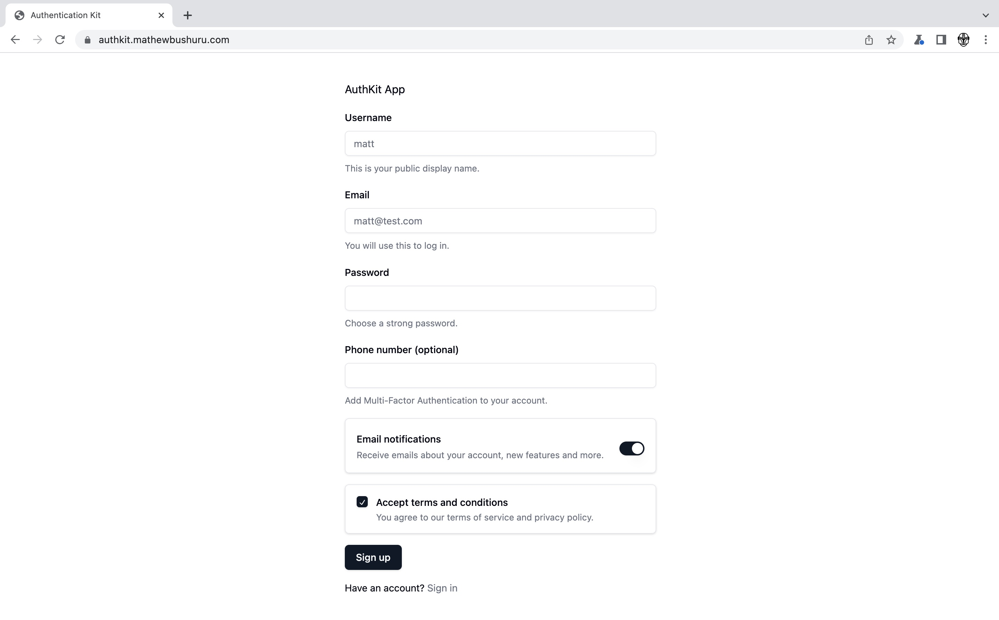
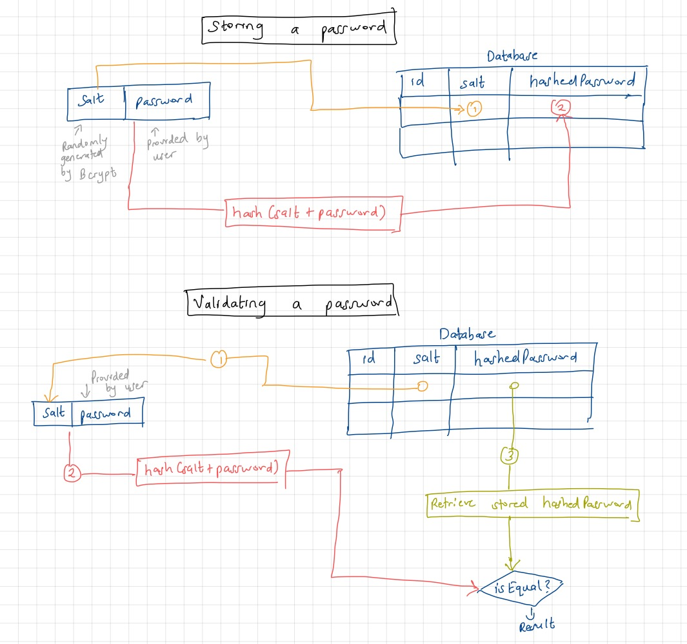

<h2 align="center"> Authentication Kit </h1>

This is a generic and reusable implementation of authentication strategies in ReactJS / ExpressJS web apps.



##### How it works

This app uses token based authentication where we store the JSON Web  Token (JWT) clientside in the browser's local storage. The authentication/authorization process is listed below:

- Client sends login data (username/email, password).
- Server creates a JWT and returns it to client.
- Client sends authenticated request with JWT in the header. I am using RTK Query to automatically inject the token into each request's headers if it exists as shown [here](./react-frontend/src/api/auth.ts).
-  Server validates the JWT and returns the response

The diagram below shows how we store and validate the password in the backend.



A minor difference - the `salt` is not stored as a different column in the  database. It is stored in the hashedPassword column among other parameters as follows:

```sh
$[algorithm]$[cost]$[salt][hash]
```

##### Tech Stack 

- [`TypeScript`](https://www.typescriptlang.org/) - Same language for both the frontend and backend.

Frontend
- [`React`](https://react.dev/) - frontend
- [`TailwindCSS`](https://tailwindcss.com/) - styling
- [`Redux / RTK Query`](https://redux-toolkit.js.org/) - state management, data fetching and caching

Backend
- [`Node / Express`](https://expressjs.com/) - backend framework

Database
- [`MySQL`](https://www.mysql.com/) - Relational database
